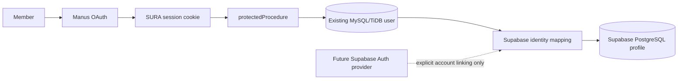

# SURA Supabase Staged Integration

## Product Requirement

SURA will gain a Supabase PostgreSQL and authentication foundation without invalidating the current Manus OAuth session model, breaking existing ownership checks, or moving private user data without validation. The immediate outcome is a verified server-only Supabase connection and an identity-mapping boundary. A later explicit release may enable Supabase Auth sign-in providers after account linking, redirect configuration, and user-acceptance testing are complete.

## Technical Requirement

The active SURA runtime continues to use MySQL/TiDB through Drizzle’s MySQL dialect and Manus OAuth through the existing `protectedProcedure` context. Supabase credentials are held only as project secrets. `SUPABASE_DATABASE_URL` must remain separate from the active `DATABASE_URL` until a PostgreSQL Drizzle schema, migration, and data-reconciliation run pass. The Supabase server key is never included in client code, browser variables, repository files, or logs.

## Project Provenance

The active Supabase project reference is **`zmumnsoyvqzvigmvrcrf`**. It was supplied by the user through project credentials rather than created by the agent, because the Supabase connector was unavailable during its maintenance window. The reference is non-sensitive; URLs, keys, passwords, and connection strings are not recorded in this document.

| Concern | Staged decision | Guardrail |
| --- | --- | --- |
| Existing sign-in | Keep Manus OAuth live | Current sessions and user IDs remain valid |
| Supabase Auth | Add only after identity mapping is verified | No automatic account replacement or duplicate user creation |
| User ownership | Canonical application user remains `users.id` during coexistence | Existing owner-scoped tRPC procedures remain authoritative |
| Database | Build Supabase PostgreSQL schema in parallel | Do not replace `DATABASE_URL` before validation and cutover approval |
| Sensitive secrets | Keep secret key and database URL server-only | Never expose through `VITE_*` values |
| Row-level security | Enable RLS and revoke direct `anon` and `authenticated` access during staging | Only server-side service operations may access identity links |
| Rollback | Leave MySQL/TiDB as source of truth through validation | Disable Supabase reads without data loss if validation fails |

## Identity Flow

The initial mapping has one immutable SURA user identifier and one optional Supabase Auth UUID. It must be unique in both directions. No browser token is accepted by protected SURA procedures until the Supabase JWT verification policy, claims mapping, and account-linking UX have been implemented and tested.

## Email Authentication Contract

SURA’s rollout uses Supabase email and password authentication only. No OAuth provider is used for new sign-ins. The browser sends an email and password to a protected SURA server procedure; the server calls Supabase Auth and writes only the SURA session cookie after validating the returned Supabase access token. A Supabase password and access token are never written to local storage, the application database, server logs, or the repository.

| Journey | Supabase action | SURA ownership rule |
| --- | --- | --- |
| Register | Create an email/password account and send verification when enabled | No SURA profile or ownership record is created until the email session is verified |
| Sign in | Exchange email/password for a Supabase session | Match the Supabase UUID to `users.openId`; create a new SURA account only when the email is not already owned by a legacy user |
| Existing email | Return an account-link requirement rather than creating a duplicate record | A member must authenticate to the original SURA account before an explicit link can be created |
| Reset password | Ask Supabase Auth to email a recovery link | The recovery URL must be allow-listed in Supabase before release |
| Sign out | Clear the SURA HttpOnly session cookie | The server never retains the Supabase refresh token |

The server verifies a Supabase access token with the project Auth user endpoint before issuing an SURA application session. Existing user IDs remain authoritative for boards, company membership, orders, reviews, and private collections. Automatic copying of existing accounts or profile data is prohibited.

## Row-Level Security During Staging

The `sura_identity_links` table has RLS enabled. The `anon` and `authenticated` roles receive no table privileges, while the Supabase `service_role` retains the minimum data privileges needed for server-side migration and reconciliation. This intentionally blocks browser access until the explicit account-linking flow exists. Because policy-only SQL is not represented in the generated Drizzle metadata, the reviewed policy is applied through the idempotent `scripts/apply-supabase-rls.mjs` server script and verified by the Supabase integration test. When SURA begins accepting Supabase sessions, the next migration must add ownership policies tied to the verified linked subject rather than loosening the staged policy.

## Implementation Plan

| Stage | Scope | Completion condition |
| --- | --- | --- |
| 1. Foundation | Verify Supabase URL, server key, and pooled PostgreSQL connection | Server-only credential health test passes |
| 2. Database contract | Add PostgreSQL Drizzle schema and identity-mapping design | Schema migration is additive and reviewed |
| 3. Auth boundary | Configure Supabase Auth project settings without switching sign-in | No active Manus OAuth behavior changes |
| 4. Controlled migration | Copy approved records with deterministic identifier reconciliation | Counts, ownership links, and samples reconcile |
| 5. Opt-in auth linking | Offer a linked Supabase Auth flow only to an authenticated member | Link is consented, reversible, and tested |
| 6. Cutover decision | Consider Supabase as a primary data/auth path | Explicit user approval and rollback plan are documented |

## Rollback

If a Supabase migration, identity map, or token validation fails, SURA continues to read and write through its existing MySQL/TiDB and Manus OAuth paths. Supabase data is retained only as a non-authoritative staged copy until the issue is resolved. No irreversible MySQL deletion, identifier replacement, or sign-in switch is allowed during the staged integration.
