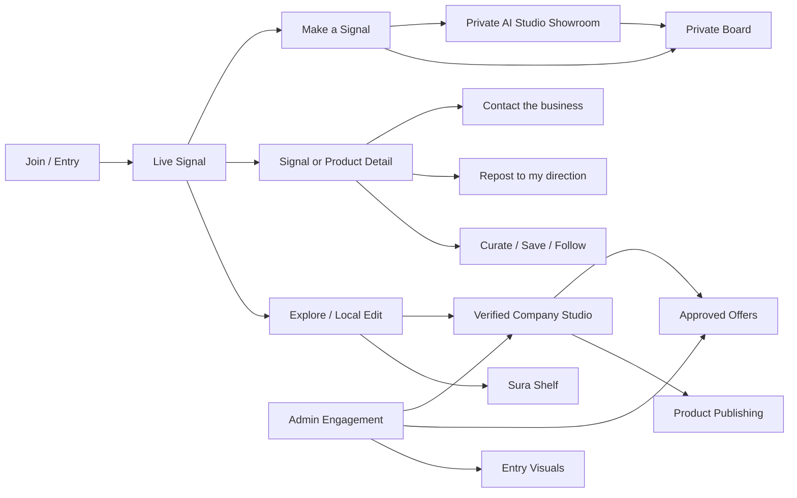

# Sura UI/UX Design Document

**Product:** Sura — Local Network  
**Document status:** Product design baseline  
**Version:** 1.0  
**Primary audience:** Product, design, engineering, company partners, administrators, and future investors  
**Design position:** Sura is an installable, image-led local aesthetics platform. It is not a marketing site, a generic social feed, or a marketplace with a social layer attached.

> **Sura in one sentence:** See something worth keeping, give it a direction, and make the next step clear. [1]

## 1. Executive design statement

Sura helps people turn visual instinct into a usable point of view. A person can discover a local product, place, company, craft, or idea; save it; carry it into a personal direction; ask for help; and move toward a clear next action. Companies use the same platform to publish a visual catalog, explain what they make, present approved offers, and receive qualified interest. The product therefore sits between visual discovery, personal curation, local commerce, and lightweight planning.

The interface must feel like entering a living visual network rather than opening a conventional website. The first impression should be image-led, editorial, local, and recognisable. Copy and controls should frame the image rather than compete with it. Every screen must answer three questions quickly: **What am I looking at? Why is it relevant to me? What can I do next?** [1]

### 1.1 Visual direction contract

> **Sura should feel like a composed local signal moving through a tactile editorial world, using strong photography, warm material contrast, and restrained digital accents, with the image or visual direction as the hero and one useful next action as the payoff.**

The visual world is built from a quiet outer stage and a focused inner experience. The stage may be deep green-black, warm stone, paper, clay, or a controlled tonal blend. Inside it, one visual object receives attention: a person’s edit, a product, a company signal, a showroom concept, or a field note. Motion explains how the object changes or where the user should look; it does not turn the interface into a decorative animation.

### 1.2 The design problem Sura solves

People often know the feeling they want before they know the exact product, service, maker, or plan. Ordinary social platforms optimise for attention, while ordinary marketplaces optimise for listings. Sura must preserve the emotional power of discovery while giving users a route toward a direction and a decision. The platform should make visual taste actionable without flattening it into a rigid category system.

Companies need the opposite bridge. They need a low-effort publishing surface that makes their work look considered, explains the product honestly, exposes current conditions such as stock and offers, and receives a more useful inquiry than a vague message. Sura’s interface should reduce the amount of work required on both sides without hiding important information.

## 2. Product differentiation

Sura uses its own language and interaction patterns so it does not read as an Instagram, TikTok, X, or generic ecommerce clone. The product can contain familiar actions such as following, liking, saving, and reposting, but the meaning and placement of those actions are specific to aesthetic discovery and local action.

| Product type | Primary organising idea | Typical user outcome | Sura’s deliberate difference |
|---|---|---|---|
| Entertainment feed | Watch the next item | Longer passive session | Sura makes the next useful action visible: curate, save, shape, ask, or contact. |
| Conversation network | Publish and respond | Public reaction or discussion | Sura keeps the first social layer focused on visual signals, following, curation, and attributed reposts. |
| Marketplace | Search and compare inventory | Purchase a listed item | Sura starts with visual direction, then provides product context, offers, and a clear inquiry or order route. |
| Portfolio or inspiration board | Collect references | Personal inspiration archive | Sura connects references to people, companies, briefs, and a public point of view. |
| Traditional website | Read a fixed brand story | Contact or browse pages | Sura is a living network with a feed, social graph, public shelves, and company publishing surfaces. |

Sura should not imitate the interaction density of a general social app. The interface should feel more like a composed sequence of signals than an infinite wall of unrelated content. The user can still move quickly, but the product gives visual work enough space to be understood.

## 3. Experience principles

### 3.1 Image before explanation

The strongest image, not the longest headline, leads a signal. The image should be large enough to establish material, mood, place, and identity. Text supplies context in compact layers: who made it, what it is, why it matters, and what action is available.

### 3.2 Direction before taxonomy

Users should be able to begin with a feeling such as **Soft Comfort**, **Savanna Atelier**, **Street Archive**, or **Motion Detail**, then narrow toward home, fashion, vehicles, pets, accessories, tattoos, or another practical lane. Directions are a discovery vocabulary and preference system, not a fixed inventory enum. [3]

### 3.3 One dominant focal point per frame

Each screen or viewport state should have one hero object, one supporting visual layer, and one primary action cue. Secondary controls are available but quiet. This rule prevents the platform from becoming a grid of equally loud cards.

### 3.4 Make the next useful action obvious

A signal should expose its next action in context. A discovery may lead to **Curate**, **Save to Shelf**, **Repost to my direction**, **Open company**, **View product**, **Make a Signal**, or **Contact the business**. The user should not need to interpret icon-only controls to understand what will happen.

### 3.5 Local context is part of relevance

Place, maker, availability, delivery estimate, and local company identity are not metadata buried at the bottom. They establish whether a signal is actionable. Location should be presented as a compact contextual label, not an intrusive tracking story.

### 3.6 Trust is visible, not implied

Verification, offer approval, stock state, original attribution, and inquiry boundaries should appear exactly where the user makes a decision. Sura should not use visual polish to hide uncertainty. A product that is unavailable, an offer that is pending, or a company that is not verified must be represented honestly.

### 3.7 Mobile is a first-class composition

Mobile is not a shrunken desktop. It receives quick actions close to the thumb, a strong bottom navigation, horizontal signal rails, full-screen or sheet-based detail views, and an expanded route into creation. Desktop receives more simultaneous context and a minimizable navigation rail. [1]

### 3.8 Quiet complexity

The first release should not launch open-ended direct messages. A moderated inquiry route is easier to understand and operate than a message board with unread states, abuse handling, delivery guarantees, and moderation queues. [3] The interface should make this boundary feel intentional rather than unfinished.

## 4. Users and core jobs

### 4.1 The explorer

The explorer arrives with a mood, a practical need, or an open-ended desire to see what is happening locally. They want to discover something that feels relevant, understand it quickly, and keep the useful parts. Their primary route is **Live Signal → visual detail → curate/save/follow → next action**.

### 4.2 The composer

The composer already has a direction but needs help turning it into a clearer plan. They use a personal edit, a saved board, a brief, or AI Studio to combine references into an actionable direction. They want to see their taste become legible without losing ownership of it.

### 4.3 The company maker

The company maker wants to publish good work without running a separate content system. They need to upload a product gallery, write a useful description, expose price and stock, configure an offer, preview the public presentation, and receive qualified interest. Product publishing is an editorial workflow first and a data-entry form second. [2]

### 4.4 The administrator and curator

The administrator protects trust and quality. They manage entry visuals, verify companies, review offers, control public visibility, and maintain a consistent first impression. Admin tooling should be operationally clear, with queues, statuses, previews, and audit-friendly actions rather than hidden switches.

## 5. Information architecture

### 5.1 Primary navigation

| Route or surface | User question it answers | Primary actions |
|---|---|---|
| **Home / Live Signal** | What is worth seeing now? | Curate, save, follow, open detail, make a signal. |
| **Explore / Local Edit** | Which direction or local lane fits me? | Browse directions, filter by practical lane, open people and companies. |
| **Make a Signal** | How do I turn an idea into a brief or edit? | Start a brief, attach references, choose a direction, request help. |
| **Saved Shelf** | What have I kept for later? | Group, remove, compare, turn a saved set into a brief. |
| **AI Studio** | How can I shape a direction visually? | Open private Showroom, adjust visual references, send to a brief. |
| **Profile / Sura Shelf** | What does my direction look like publicly? | Edit profile, view reposts, manage shelf windows, inspect following. |
| **Company Studio** | How does a company publish and manage interest? | Manage catalog, offers, inquiries, contacts, and public studio. |
| **Admin / Engagement** | What needs review or publishing? | Verify, approve, reject, publish, and manage entry visuals. |

The desktop shell uses a minimizable rail. The expanded rail shows the Sura mark, route names, and contextual labels. The collapsed rail retains icon plus tooltip access and leaves more room for image-led content. The mobile shell uses a persistent bottom navigation for **Home**, **Explore**, **Make a Signal**, **Saved Shelf**, and **Profile**, with AI Studio reachable from the creation route and profile context.

### 5.2 Conceptual platform map

### 5.3 Naming system

| Generic phrase to avoid | Sura term | Usage rule |
|---|---|---|
| Story or highlight | **Sura Shelf** | Use for a public profile’s compact visual windows. |
| Post | **Field Note** or **Signal** | Use Field Note for a short visual note; use Signal for the discoverable unit. |
| Like | **Curate** | Use when the action means showing interest or helping a signal travel. |
| Share | **Repost to my direction** | Keep original company attribution visible. |
| Feed | **Live Signal** or **Following** | Use Live Signal for fresh discovery and Following for the user’s social graph. |
| Create post | **Make a Signal** | Use for a brief, field note, or AI-assisted direction. |
| Wishlist | **Saved Shelf** | Use for items or references kept for later. |

## 6. Visual design system

### 6.1 Material and palette

Sura uses a warm editorial base with a deep platform shell and a small luminous accent. Image content is the dominant source of color; interface colors should frame it rather than compete with it. A light interface uses paper, stone, warm ink, clay, and muted brown. A dark interface uses deep green-black, soft cream, moss, and a controlled acid-lime accent. The selected aesthetic direction may change the visual atmosphere, but the interaction hierarchy and semantic colors remain stable.

| Token | Light baseline | Dark baseline | Meaning |
|---|---|---|---|
| `--color-bg` | Warm paper `#F4F0E9` | Deep green-black `#11130F` | Outer application stage. |
| `--color-surface` | Soft cream `#FBF8F2` | Deep surface `#1A1D17` | Form, sheet, and reading surfaces. |
| `--color-ink` | Dark brown-black `#211D18` | Warm cream `#F4EFE6` | Primary text and strong controls. |
| `--color-muted` | Stone `#EEE7DC` | Moss-charcoal `#273026` | Secondary surface and quiet grouping. |
| `--color-accent` | Clay `#A66231` | Acid lime `#D7FF4D` | Focus, selected state, or deliberate emphasis. |
| `--color-success` | Leaf `#58733D` | Lime-leaf `#B7D45A` | Confirmed, approved, available. |
| `--color-warning` | Amber `#A96834` | Warm amber `#D39A52` | Pending, attention, incomplete. |
| `--color-danger` | Brick `#9B4D37` | Coral-brick `#E27A5F` | Destructive or blocked action. |
| `--color-rule` | Warm border `#DCCFBE` | Moss border `#3C4535` | Separation and structure. |

Color is semantic. A discount, verification state, or error must not depend on a single hue; it also needs text, icon, and placement. Contrast must be tested for normal text, large text, controls, focus rings, and disabled states.

### 6.2 Typography

Typography uses a disciplined sans-serif body system with a strong editorial display role where the screen needs a memorable hook. Large display text is short and declarative. Labels are compact, uppercase, and tracked. Body copy is readable, never compressed into decorative microtext.

| Role | Direction | Typical use |
|---|---|---|
| Display | Heavy, tight, high contrast | Entry hook, hero direction, one-line thesis. |
| Title | Bold, compact | Signal, company, product, or screen title. |
| Body | Neutral, readable | Descriptions, guidance, terms, and product detail. |
| Kicker | Small uppercase with tracking | Location, lane, verification, status, and section labels. |
| Metadata | Compact but readable | Price, stock, timing, offer conditions, attribution. |

Text should not be placed over busy imagery without a scrim, a quiet crop, or a separate surface. The design system should never use low-contrast text simply because a screenshot appears atmospheric.

### 6.3 Layout and spacing

The layout is editorial rather than dashboard-dense. A screen can use a generous hero object, but empty space must be intentional and connected to the focal point. Every major region should have a reason to exist: orientation, context, proof, or action. Use a 4-point spacing base, with 8, 12, 16, 24, 32, 48, and 64 as common rhythm values.

| Element | Desktop guidance | Mobile guidance |
|---|---|---|
| Outer page gutter | 24–40 px depending on viewport | 16–20 px, with edge-to-edge media when useful |
| Primary content width | 1120–1280 px | Full width with safe gutters |
| Signal hero | One dominant image, often 4:5 or 16:10 | 4:5 or tall editorial crop |
| Product detail | Image gallery beside structured information | Gallery above information with sticky action |
| Rail | 240 px expanded, 72 px collapsed | Replaced by bottom navigation and sheet menu |
| Touch target | At least 44 × 44 px | At least 44 × 44 px, thumb-reachable |
| Form rhythm | 12–16 px between controls | 12–16 px, with larger vertical breathing room |

### 6.4 Imagery rules

The first image is the hero image. Additional images should add information rather than repeat the same crop: angle, material detail, colourway, fit reference, packaging, scale, or context. Product publishing accepts up to eight images, with the first image leading the gallery and the rest ordered as supporting evidence. [2]

Every image must have a meaningful alternative description when it communicates content. Decorative textures use empty alternative text. Images must be bounded with explicit dimensions or aspect-ratio containers to reduce layout shift. Use object-fit containment for product media when the full object must remain visible; use cover when the crop is part of the editorial composition.

## 7. Core component language

### 7.1 Live Signal

A Live Signal is the fundamental unit of discovery. It consists of one visual hero, a compact identity line, a short thesis or Field Note, a local or lane label, and a small action row. The signal should be readable as a poster at a small size and understandable without opening it. Its primary action changes by context: **Open edit**, **View product**, **Curate**, or **Make a Signal from this**.

### 7.2 Sura Shelf

The Sura Shelf is a public profile’s visual collection. It replaces story/highlight language and creates a recognisable profile structure without imitating another platform. The default windows are **Point of View**, **Field Notes**, **Made Here**, and **Next Signal**. People and companies can use the same structure with different content rules. Each window is image-first, labelled, and accessible through tap, click, keyboard, and screen-reader name.

### 7.3 Product detail

Product detail uses a two-column editorial-commerce composition on desktop and a stacked, action-oriented composition on mobile. The image area contains one large hero image, thumbnail controls, and optional automatic progression that pauses when the user interacts. The information area contains product name, company identity, concise description, options, stock state, original price, effective price, saving, discount title and code, minimum-spend condition, and delivery or order estimate. [2]

The public card may show a small supporting strip, but it must not force users to infer the description, price, or offer from the image. The detail view is the source of truth for the decision. The primary action remains visible when the user reaches the relevant information.

### 7.4 Offer treatment

An approved offer is presented as a transparent price transformation: original price, effective price, savings, offer scope, code, validity, and conditions. Product-specific offers are labelled **Product offer**; whole-shop offers are labelled **Shop-wide**. Pending or rejected offers are not shown as public discounts. The interface must never imply that an offer is active if the server has not approved and exposed it. [2]

### 7.5 Company Studio

Company Studio is a publishing environment, not a generic admin dashboard. It should lead with a preview of how the public company signal will look, then provide structured editing controls. The product publishing sequence is **Identity → Gallery → Description → Price and stock → Options → Offer → Preview → Submit**. Ownership and verification status should be visible before the user performs a publish action.

### 7.6 Make a Signal composer

Make a Signal begins with an intent choice rather than a blank form. The user chooses **shape a direction**, **ask for a product or service**, **save a field note**, or **start an AI Studio edit**. The composer progressively requests only information needed for the chosen intent. References are shown as a visual strip, and the user can reorder or remove them before submitting.

### 7.7 AI Studio Showroom

AI Studio is private and begins as a visual showroom. A lane may represent home, wardrobe, footwear, products, vehicles, detailing, tattoos, or pet accessories. A four-step visual rail—**Front**, **Angle**, **Side**, and **Detail**—lets the user inspect a concept with previous/next controls, direct view buttons, and a range slider. Generated concepts become the first view when available; managed fallback visuals preserve the stage while generation is pending. [1]

The Showroom is a visual proportion and direction aid, not a sizing or fit guarantee. Wardrobe and footwear may offer height and proportion references, but the interface must remind users to confirm actual measurements. Vehicle and detailing routes must make clear that final fit, parts, labour, inspection, and service scope determine the real quote. [1]

### 7.8 State surfaces

Sura uses stable state surfaces instead of page-specific improvisation. Loading, empty, blocked, error, pending, approved, and success states share the same hierarchy as content screens. Skeletons preserve the geometry of the platform but do not pretend to be content. When an operation cannot complete, the state must explain what happened, what remains safe, and what the user can do next.

## 8. Core user journeys

### 8.1 Entry and account creation

The Join screen is the first protected entry point. It uses a composed image sequence on one side and a readable sign-in surface on the other. The page shows **Sign in** and **Create account** as explicit modes. Create account asks for email, password, and confirmation password, then explains that Supabase will send an account-confirmation email. Sign in uses email and password directly. Password recovery is an explicit, separate state.

The callback state never depends on an endless spinner. A verified Supabase session is exchanged once for the Sura application session, the shared auth cache is hydrated, and the user is routed into the private space. If exchange, database, or environment configuration fails, the user sees a bounded error with a retry route. The public `/ai-studio-preview` remains read-only and is never used as a backdoor into private AI Studio.

### 8.2 Discover, curate, and save

A new user lands on a Live Signal sequence that establishes the platform through images, local context, and one clear action. They can open a detail view, curate a signal, save it to the Saved Shelf, follow a person or verified company, or begin a new direction from it. A saved item retains enough context to remain useful later: source identity, image, title, lane, and original route.

### 8.3 Repost to my direction

Reposting is a distribution action that helps a person build a visible point of view. The repost action must show the original company or creator attribution, allow an optional short note, and preview how the signal will appear on the user’s public Sura Shelf. A repost never copies ownership. Removing a repost removes the user’s distribution but not the original business post. [3]

### 8.4 Company publishes a product

The company owner selects **New product**, uploads up to eight images, chooses the lead image, writes a useful description, enters KES price and stock, adds options, and sees a live public preview. The server verifies company ownership, validates image type and size, uploads media to managed storage, and persists the ordered gallery. A product becomes public only when the parent company is verified and the product is active. [2]

### 8.5 Company creates an offer

The company selects **Product offer** or **Shop-wide offer**, enters the value and conditions, previews the effective price, and submits for review. The offer remains private and pending until an administrator approves it. The public surface exposes the original price, effective price, savings, scope, code, and minimum-spend condition together. [2]

### 8.6 Brief to company inquiry

A user can turn a visual direction or saved set into a brief. The brief provides the company with the user’s selected references, desired direction, practical constraints, and preferred next step. Contact remains a moderated inquiry route rather than open-ended direct messaging. The interface should make the handoff clear: **Your brief is ready → Choose a company → Send inquiry → Track response**.

### 8.7 Admin entry visual management

An administrator opens **Admin → Engagement → SURA / ENTRY VISUALS**, names a visual set, uploads one to eight JPEG, PNG, or WebP images, reviews the lead/supporting order, and publishes. The first uploaded image becomes the lead image. If no active set exists, bundled fallback visuals remain available. Public entry visuals are separate from private personal edit media. [1]

## 9. Responsive behavior

### 9.1 Mobile

The mobile composition prioritises the next action and the thumb zone. The bottom navigation remains visible without obscuring content. Live Signal rails scroll horizontally with a visible continuation cue. Detail views use full-width media, compact metadata, and a sticky or easily re-entered primary action. Forms use a single column, generous field spacing, visible labels, and inline validation.

Mobile users receive more immediate creation affordances than desktop users: **Make a Signal**, **AI Lens**, and **Saved Shelf** should be available within one tap from Home. The navigation sheet may reveal secondary routes, but the primary five destinations should never be hidden behind a menu.

### 9.2 Tablet

Tablet uses a hybrid composition. The desktop rail may remain expanded when the viewport allows it, but product detail and company preview can use a stacked or asymmetric split. Touch targets remain mobile-sized, and horizontal rails should not become cramped multi-column grids.

### 9.3 Desktop

Desktop provides a minimizable rail and a wider editorial canvas. The expanded rail should expose labels and current route; the collapsed rail should preserve recognisable icons and accessible tooltips. The layout can use two-column product detail, asymmetric signal grids, and side-by-side preview/edit surfaces, but the hero object remains dominant.

### 9.4 Responsive acceptance rules

| Scenario | Required behavior |
|---|---|
| 320–390 px mobile | No horizontal page overflow; forms remain readable; CTA stays reachable. |
| Mobile with keyboard open | Focused field remains visible; error or success notice is not hidden below the keyboard. |
| Slow image network | Layout reserves image space; fallback or skeleton state does not collapse the composition. |
| Desktop rail collapsed | Route identity remains accessible through tooltip, focus label, and active-state treatment. |
| Reduced motion enabled | No essential information depends on animation; image swaps and state reveals settle immediately. |
| High contrast or forced colors | Text, focus, selected state, verification, and errors remain distinguishable without subtle backgrounds. |

## 10. Motion and transition system

Motion follows **hook → orientation → proof → transformation → payoff → action**. On the Join screen, the image collage and entry panel reveal in short staggered transitions; on a Signal, the visual is immediately readable and controls settle into place; in a product gallery, the image changes explain the next angle rather than performing an unrelated loop.

| Motion purpose | Pattern | Starting duration |
|---|---|---:|
| Micro interaction | Press, focus, selected tab, thumb feedback | 160–260 ms |
| Panel or sheet | Enter, open detail, reveal contextual controls | 320–650 ms |
| Hero reveal | Entry composition, showroom object, major state change | 700–1200 ms |
| Image swap | Scale down slightly, replace, settle | 320–820 ms |
| Error or success state | Short opacity/translate reveal | 220–360 ms |

Use transforms and opacity where possible. Avoid persistent parallax, large blur filters, motion that delays comprehension, and timers that compete with user input. Automatic progression must pause on interaction and provide direct controls. `prefers-reduced-motion: reduce` disables nonessential animation while preserving order, focus, and feedback.

## 11. Accessibility and inclusive content

Sura’s visual identity cannot depend on visual ability. Every meaningful image has alternative text; every icon-only action has an accessible name; every carousel has previous, next, and direct-position controls; every selected state has a non-colour indicator; and every error is announced through a semantic live region or is placed adjacent to the field it describes.

The Join flow must support keyboard navigation through mode tabs, fields, password visibility, submit, recovery, and policy links. Focus must remain visible against both light and dark themes. Labels remain visible above fields rather than relying on placeholders. Password requirements and confirmation mismatch are expressed as text, not only as border colour.

Content should use plain, direct language. Terms such as **Curate**, **Repost to my direction**, and **Make a Signal** are distinctive, but the first use may include a short supporting explanation. Sura should be local without assuming that every user has the same language, device, income, location precision, or ability to complete a purchase immediately.

## 12. Trust, privacy, and permission boundaries

The platform distinguishes public discovery, authenticated social actions, private planning, verified company publishing, and administrator operations. Only authenticated users can curate, save to private collections, follow, repost, create private briefs, or access AI Studio. Only verified companies can publish public business posts in the first social slice. Reposts preserve original attribution and do not change ownership. [3]

Required session cookies support authentication. Optional theme, aesthetic, and layout preferences are stored only after the person accepts optional preference storage. Declining optional preferences does not make the platform unusable; it simply limits persistence to the current session. [1]

The public AI Studio preview must not upload, generate, persist, or expose private user work. It exists as a read-only showroom preview. The private AI Studio must enforce the signed Sura session at the server boundary, not only through client-side route hiding.

## 13. Admin and company design governance

### 13.1 Admin review surfaces

Admin screens should be queue-first and decision-oriented. Each queue row exposes identity, status, submitted time, affected public surface, and the minimum evidence needed to approve or reject. Destructive actions require confirmation and explain their public consequence. Review state should never be represented only by colour or an unexplained icon.

### 13.2 Company publishing safeguards

Company tools should guide honest content: material, fit, care, stock, fulfilment, delivery expectations, and offer conditions. A live preview is not a marketing simulation; it is a representation of the public surface the user is about to publish. Before high-volume uploads, production hardening should include malware scanning, EXIF stripping, dimension normalization, responsive thumbnail generation, and archive/edit operations. [2]

### 13.3 Public/private boundary table

| Surface | Public? | Required boundary |
|---|---:|---|
| Live Signal from verified company | Yes | Company verification and active public post. |
| Personal edit and private board | No | Authenticated owner access. |
| Repost on public profile | Conditional | Public profile and original attribution. |
| AI Studio Showroom | No | Authenticated session and server-side authorization. |
| `/ai-studio-preview` | Yes | Read-only; no upload, generation, persistence, or private data. |
| Pending discount offer | No | Admin approval required before public exposure. |
| Inquiry/contact record | Restricted | Authenticated user/company access with auditable route. |
| Sign-in entry visuals | Yes | Admin-managed public media with safe fallback. |

## 14. Measurement framework

The following are proposed design-health measures, not claims about current performance. They should be instrumented only after consent and with privacy-safe event definitions.

| Design question | Candidate signal | Why it matters |
|---|---|---|
| Do new users understand the entry? | Completion from Join to confirmed private session | Detects auth friction without treating a page view as success. |
| Is discovery actionable? | Signal open → curate/save/follow or next-action rate | Measures whether images lead to meaningful behavior. |
| Does a direction become useful? | Saved set → brief or AI Studio start | Tests the core discovery-to-planning bridge. |
| Does reposting build identity? | Repost → public Shelf view or follow | Measures whether distribution creates visible personal direction. |
| Can companies publish with low effort? | Draft → preview → publish completion and time | Tests the publishing studio promise. |
| Are offers understandable? | Product detail interaction with price/offer fields and inquiry start | Tests transparent conversion rather than accidental clicks. |
| Is trust preserved? | Verification rejection reasons, report rate, inquiry completion | Identifies quality and safety issues. |

## 15. Implementation guidance

The design system should be data-driven. Define tokens before components, keep state names explicit, and centralise repeated patterns such as `Stage`, `Signal`, `Shelf`, `Gallery`, `OfferSummary`, `Composer`, `Notice`, `LoadingState`, and `ActionBar`. Product imagery, company identity, and offer status should be data inputs rather than duplicated layout branches.

The application should keep visual changes separate from permission checks. A hidden button is not an authorization boundary. Server procedures must enforce company ownership, public visibility, admin permissions, and authenticated social actions. The client should still provide immediate feedback, but the server remains the source of truth.

The current stack supports a React/Tailwind client, an Express/tRPC server, a MySQL-compatible Drizzle application database, Supabase Auth for email identity, managed object storage for product and entry imagery, and a Vercel serverless deployment. The UI/UX system should preserve these boundaries: Supabase authenticates the identity, Sura creates the application session, MySQL stores product and social state, and public previews never inherit private capabilities.

### 15.1 Recommended delivery order

| Stage | Scope | Definition of done |
|---|---|---|
| 1 | Shell and design tokens | Light/dark/system modes, rail, mobile bottom nav, focus states, and state surfaces are consistent. |
| 2 | Live Signal and Sura Shelf | Feed, public profile, visual rails, curate, follow, save, and repost flows use the Sura language. |
| 3 | Product detail and offers | Gallery, description, stock, options, pricing transformation, approved offers, and inquiry action are clear. |
| 4 | Company Studio | Product upload, preview, verification boundary, and offer submission are usable on desktop and mobile. |
| 5 | Make a Signal and AI Studio | Brief composer, private Showroom, multi-angle rail, and handoff into planning work end to end. |
| 6 | Admin governance | Entry visuals, company review, offer queues, and visibility controls are auditable. |
| 7 | Quality hardening | Accessibility, reduced motion, slow-network states, image reliability, privacy consent, and security boundaries are verified. |

## 16. Design acceptance checklist

A release is visually and experientially ready when a first-time user can identify Sura as a distinct local aesthetics platform within one screen, understand the visible primary action without reading a manual, and move from an image to a useful next step without losing context.

| Check | Pass condition |
|---|---|
| Brand fit | The screen feels like Sura’s image-led local network, not a generic social or storefront template. |
| Hierarchy | One focal image or direction leads; secondary controls remain subordinate. |
| Vocabulary | Sura terms are used consistently and are explained at first use when needed. |
| Action clarity | Every major state has one obvious next action and a safe recovery path. |
| Product clarity | Product description, company identity, stock, price, discount, and delivery context are not hidden. |
| Social integrity | Follow, curate, repost, attribution, and visibility rules are understandable. |
| Company usability | Publishing is preview-led, ownership-aware, and practical on mobile. |
| Auth reliability | Sign in, Create account, confirmation, recovery, exchange, timeout, and Sign out states are bounded and visible. |
| Accessibility | Keyboard, screen reader, focus, contrast, alt text, reduced motion, and non-colour status cues are supported. |
| Performance | Image dimensions are reserved, transitions use composited properties, and slow networks have stable states. |
| Privacy | Required sessions and optional preferences are distinguished; public preview cannot access private capabilities. |
| Originality | The platform uses its own structure, vocabulary, and visual grammar rather than copying another network. |

## 17. Final product principle

Sura should make a person’s visual instinct feel worth following, then make the next useful action feel obvious. The platform succeeds when an image is not merely viewed; it becomes a direction, a saved reference, an attributed signal, a clear inquiry, or a practical next step.

## References

[1]: ../README.md "Sura product README and platform behavior"
[2]: product-publishing.md "Sura Product Publishing and Promotion Flow"
[3]: sura-social-model.md "Sura Social Model"
